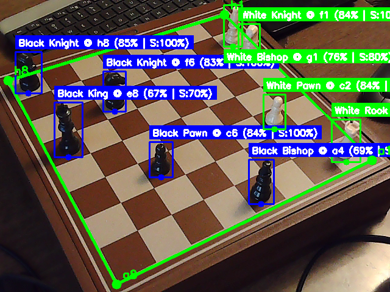
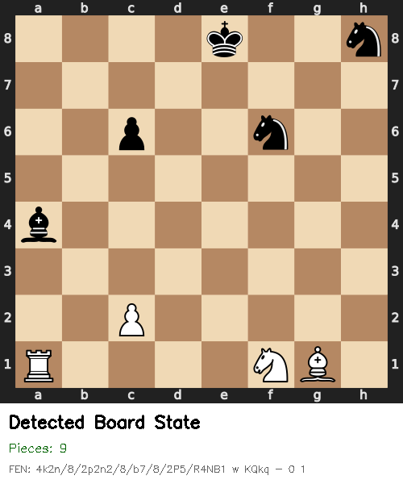

# Industry Chess

**Computer Vision Testbed for Real-Time Process Validation**

Industry Chess is a computer vision system designed to explore **visual validation of physical process state**. The project uses a chessboard as a controlled physical environment to prototype techniques for converting visual input into structured, machine-readable state transitions.

The objective is not to play chess. The chessboard simply provides a deterministic, rule-constrained system that makes it possible to develop and test validation logic before applying the same techniques to real industrial workflows.

The system demonstrates how computer vision can be used to:

- Infer structured state directly from observed physical configuration
- Detect missing, misplaced, or incorrect components
- Validate state transitions between steps
- Record timestamped events for process analytics
- Measure cycle time between operations

Industry Chess serves as a sandbox for developing methods that could later be applied to assembly validation, inspection systems, or automated quality control.

# Overview

Industry Chess observes a physical chessboard using a camera and continuously converts the board state into a structured digital representation.

Each frame from the camera feed passes through a pipeline that performs:

- Board detection and geometric normalization
- Piece detection and classification
- Square coordinate mapping
- Board state generation using **FEN (Forsyth–Edwards Notation)**
- State comparison between frames
- Move inference and validation
- Timestamped event logging

The result is a continuously updated, machine-readable description of the physical system.

# System Architecture

The system converts raw visual input into structured state through a layered pipeline.

Camera Feed → Board Detection → Homography Normalization → Piece Detection (YOLO) → Square Mapping → FEN Generation → State Comparison → Move Validation → Event Logging

Each stage has a specific responsibility:

| Layer            | Role                                    |
| ---------------- | --------------------------------------- |
| Camera Input     | Provides real-time visual data          |
| Board Detection  | Identifies chessboard corners           |
| Homography       | Normalizes board perspective            |
| Piece Detection  | Detects and classifies pieces           |
| Square Mapping   | Assigns detections to board coordinates |
| FEN Generation   | Creates structured board state          |
| State Comparison | Detects state transitions               |
| Move Validation  | Infers and validates moves              |
| Event Logging    | Records structured process events       |

This architecture mirrors how computer vision systems in industrial environments convert physical observations into actionable data.

# Industrial Analogy

The same system architecture can be applied to manufacturing or robotics workflows.

For example:

| Chess System    | Industrial Equivalent |
| --------------- | --------------------- |
| Chess pieces    | Physical components   |
| Board squares   | Assembly locations    |
| Moves           | Process steps         |
| FEN state       | Assembly state        |
| Move validation | Process validation    |

In an industrial setting, a similar pipeline could be used for:

- Assembly verification
- Fixture state monitoring
- Step-by-step procedural validation
- Quality-control inspection
- Cycle-time measurement

Instead of relying on operator input or manual logging, process state is inferred directly from visual observation.

# Example Outputs

The system generates structured outputs that can be consumed by downstream systems.

Examples include:

- FEN string representing complete board state
- Detected move (example: `e2 → e4`)
- Timestamped state transitions
- Piece count validation
- Cycle-time measurement between moves

These outputs are designed to be machine-readable and suitable for storage, analytics, or process monitoring.

# Tech Stack

* Python
* OpenCV
* YOLOv8
* NumPy
* python-chess

# Current Status

The system currently demonstrates the full state-extraction pipeline, with some limitations in robustness.

Implemented:

- Piece detection and classification
- Square mapping
- Stable FEN state generation
- Basic event logging
- Move inference from state transitions

Known limitations:

- Automatic board detection is inconsistent under some lighting conditions
- Manual corner selection used during demonstration
- Structured database storage not yet implemented
- Analytics layer not yet developed

Despite these limitations, the system can generate an accurate board state and move log in real time.

# Roadmap

Future development will focus on improving robustness and extending the system toward a full process-validation framework.

Planned improvements:

- Improve board detection reliability
- Add anomaly detection for illegal states
- Expand structured event logging
- Integrate persistent storage for analytics
- Explore hardware manipulation (gantry or robotic arm)
- Implement closed-loop validation systems

# Design Principle

Industry Chess explores a simple but powerful architectural idea:

Physical State → Structured Representation → Validation → Logged Event

Reliable extraction of enforceable state from visual input is a central problem in computer vision applications for manufacturing and robotics.

Industry Chess exists to prototype and refine that capability.
